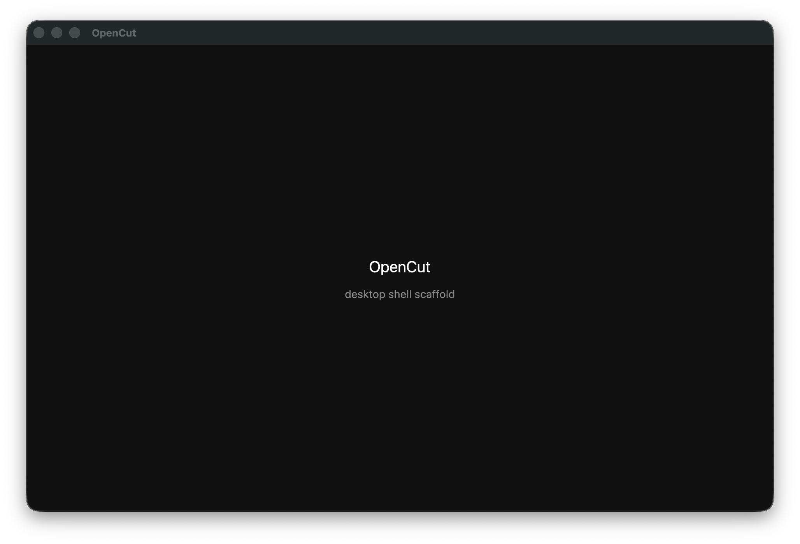
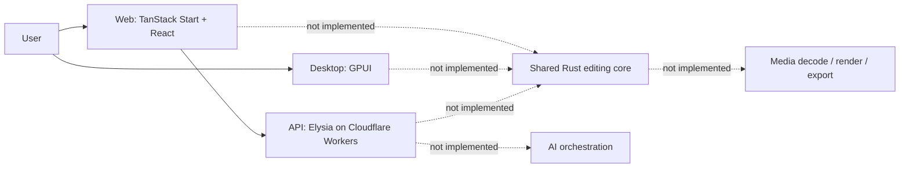
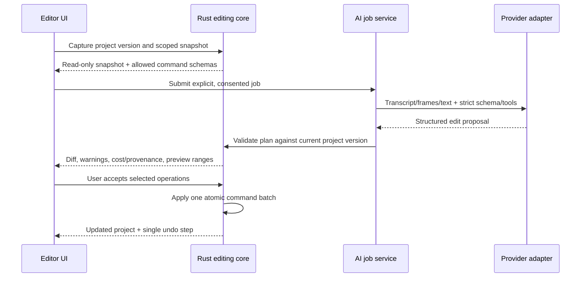

# SceneMeld: rebrand, verified audit, working-product contract, and AI architecture

- Audit date: 2026-07-14
- Audited commit: `bab8af83` (`main`)
- Scope: the current `OpenCut-app/OpenCut` rewrite, including its web, API, and macOS desktop targets
- Proposed product name: **SceneMeld** (working name; formal trademark and app-store clearance still required)

## Executive verdict

The current branch is a compilable scaffold, not a video editor. Its runnable feature surface is:

- a web page that renders `hello world!`;
- an Elysia/Cloudflare Worker with health and echo endpoints; and
- a GPUI desktop window that renders an OpenCut title and `desktop shell scaffold` status.

No media can be imported, decoded, previewed, placed on a timeline, edited, saved, or exported. There is no project document model, edit command system, media engine, renderer, persistence layer, plugin runtime, MCP server, or AI implementation. The repository README accurately says that the rewrite is being designed from the ground up and that the classic repository is the usable editor today.

The right next move is not to add a chat box to the scaffold or relabel it as finished. First establish a deterministic Rust editing core and a reversible command protocol. AI can then propose validated commands against that protocol without being allowed to mutate a project directly.

## New product identity

### Selected working name: SceneMeld

**SceneMeld** expresses the product's central job: combining source material into a coherent scene, sequence, and story. It is short enough for a desktop title bar and command-line tool, does not imitate CapCut's name, and supports an ownable precision-craft visual language.

SceneWeld was rejected during Phase 0 because `sceneweld.com` is already registered. An initial exact-match screen for SceneMeld found no general-web or GitHub repository collision; npm and PyPI returned no exact package; and the `.com` registry returned no domain record on 2026-07-14. Availability can change and this is not legal clearance. Before publishing the name, commission a proper trademark search in intended markets and verify app stores, social handles, other package registries, bundle identifiers, and domains. Keep source identifiers unchanged until that gate passes.

### Brand platform

| Element            | Decision                                                                                                 |
| ------------------ | -------------------------------------------------------------------------------------------------------- |
| Brand promise      | Professional editing that stays understandable, local, and under the creator's control                   |
| Positioning        | The open-source, local-first video editor with a deterministic editing core and reviewable AI assistance |
| Primary audience   | Independent creators, educators, open-source teams, agencies, and technical filmmakers                   |
| Tagline            | **Shape every scene. Own every cut.**                                                                    |
| Product descriptor | Local-first open-source video editor                                                                     |
| Personality        | Precise, capable, direct, calm, craft-focused                                                            |
| Differentiator     | AI proposes transparent, reversible edits; it never owns the timeline or silently changes a project      |

### Messaging hierarchy

1. **Shape every scene. Own every cut.**
2. Edit locally without an account, upload requirement, or subscription dependency.
3. Move quickly with a fast native editor and a shared deterministic Rust core.
4. Use AI when it helps; inspect its evidence, accept only selected changes, and undo the result in one step.
5. Keep portable projects and ordinary media assets instead of locking work to a provider.

Use “AI-assisted,” not “AI-powered,” as the default descriptor. The product is an editor first. Avoid claims such as “one-click professional video,” “fully autonomous editing,” “100% bug-free,” or “your data never leaves your device” when the user explicitly invokes a cloud feature.

### Visual identity specification

| Token       | Value     | Use                                                    |
| ----------- | --------- | ------------------------------------------------------ |
| Meld Black  | `#0B0E14` | Editor canvas, desktop chrome, primary dark background |
| Workbench   | `#151A23` | Panels, inspectors, timeline tracks                    |
| Steel       | `#8D98A8` | Secondary labels and inactive controls                 |
| Paper       | `#F7F8FA` | Primary text on dark and light-mode canvas             |
| Arc Orange  | `#FF6B35` | Brand mark, playhead, focus and selected-state accent  |
| Signal Blue | `#3867FF` | Links, informational actions, collaboration state      |
| Safe Green  | `#29C78A` | Completed jobs and validated output only               |
| Fault Red   | `#EF4D5A` | Destructive actions and errors only                    |

Arc Orange on Meld Black has a calculated WCAG contrast ratio of approximately 6.81:1; Paper on Meld Black is approximately 18.18:1; white on Signal Blue is approximately 4.61:1. These combinations pass AA for normal text, but every implemented token/state must still be tested in context, including disabled, focus, hover, waveform, and color-blind states.

- Typography: Inter Variable for product and marketing UI; a bundled system-monospace stack for timecode, codecs, frame counts, logs, and commands.
- Geometry: tight 4 px base grid, 6-8 px control radii, and squared media surfaces; avoid oversized consumer-social cards.
- Motion: functional and short (100-180 ms). Timeline manipulation, scrubbing, and transport feedback must not be eased or delayed.
- Imagery: actual editor surfaces, frame strips, waveforms, and creator work. Do not use generic AI glows, robots, scissors, film reels, or copied CapCut motifs.
- Icon style: 1.75 px optical stroke at 20/24 px, filled only for active transport states. Icons require text labels or accessible names.

### Logo direction

The recommended mark is a continuous angular seam that merges two offset frame planes and resolves into an abstract **S**. A small Arc Orange “meld point” can identify the join at favicon size. The wordmark should be custom-spaced SceneMeld in a neutral grotesk, with no play triangle or scissors. Required production variants are horizontal, compact, symbol-only, one-color, light-background, dark-background, and 16/32 px optical corrections.

This is a design direction, not finished logo artwork. Final marks require original vector production, similarity review, trademark clearance, and legibility testing before release.

### Product naming architecture

| Surface                  | Proposed name                                   |
| ------------------------ | ----------------------------------------------- |
| Desktop product          | SceneMeld Desktop                               |
| Browser product          | SceneMeld Web                                   |
| Shared editing engine    | SceneMeld Core                                  |
| Optional assistant       | SceneMeld Assist                                |
| CLI binary               | `scenemeld`                                     |
| Portable project file    | `.scenemeld`                                    |
| Autosave/recovery bundle | `.scenemeld-recovery`                           |
| Rust crates              | `scenemeld-project`, `scenemeld-commands`, etc. |

Do not perform a blind search-and-replace. After clearance, migrate display strings first, then package/crate names, bundle IDs, Cloudflare resources, telemetry namespaces, repository metadata, and finally file associations. Preserve import aliases and project-schema migrations so pre-brand development files remain readable.

## What “100% working” means

“100% working” is a release status, not a promise that software can never have a bug. SceneMeld may claim it only when **every feature advertised for the release is implemented, its acceptance tests pass on every supported platform, and there are zero open release-blocking defects**. Experimental features must be visibly labeled and cannot be counted as part of the stable promise.

### Stable 1.0 feature contract

| Capability         | Required acceptance evidence                                                                                                                                            |
| ------------------ | ----------------------------------------------------------------------------------------------------------------------------------------------------------------------- |
| Install and launch | Signed/notarized or platform-equivalent package installs, launches, updates, and uninstalls on each supported OS without manual developer tools                         |
| Project lifecycle  | New/open/save/save-as/autosave/recovery/recent projects work; interrupted writes never corrupt the last durable version                                                 |
| Media import       | Supported video, audio, and still formats probe correctly; duplicates, missing files, unsupported codecs, variable frame rate, and relinking have explicit behavior     |
| Playback           | Play, pause, seek, frame-step, loop, scrubbing, and synchronized audio work from the same composition model used by export                                              |
| Timeline editing   | Select, insert, overwrite, move, trim, split, ripple delete, snapping, zoom, track lock/mute/visibility, multi-select, and undo/redo pass keyboard and pointer journeys |
| Visual editing     | Position, scale, rotation, crop, opacity, fit/fill, blend order, and basic transitions render consistently in preview and export                                        |
| Audio editing      | Gain, mute, fades, waveform, channel mapping, and peak-safe mixing work; exported A/V remains synchronized                                                              |
| Text and captions  | Create/style/time captions and titles, import/export SRT or WebVTT, render Unicode, and safely handle missing fonts                                                     |
| Export             | At minimum H.264/AAC MP4 and a lossless/intermediate preset support validation, progress, cancellation, retry, and deterministic fixture comparison                     |
| Persistence        | Project schema is versioned and migratable; reopening produces the same sequence, links, settings, and command state                                                    |
| Offline operation  | Core import, editing, save, preview, and export require neither an account nor network access                                                                           |
| AI boundary        | AI is optional; each remote job previews uploads/cost/retention, returns a version-bound proposal, applies only after confirmation, and is one undo step                |
| Accessibility      | Complete keyboard path for the core edit journey, visible focus, semantic names, scalable text, reduced motion, and contrast checks                                     |
| Failure handling   | Full disk, missing media, decode failure, canceled export, crash, offline state, expired credentials, quota exhaustion, and stale AI plans preserve the local project   |

### Supported release baseline

- Desktop: current and previous major macOS versions on Apple Silicon, plus explicitly selected Windows 11 x64 and mainstream Linux x64 targets once CI runners and media backends pass the same suite.
- Web: latest two stable releases of Chromium, Firefox, and Safari where WebCodecs/filesystem capabilities exist; unsupported capability combinations receive a clear message rather than a broken editor.
- Import baseline: H.264/H.265/VP9/AV1 containers only where the bundled/system codec license and platform support are documented; WAV, MP3, AAC, FLAC; PNG, JPEG, and WebP. Publish the exact tested matrix rather than saying “all formats.”
- Export baseline: H.264/AAC MP4 plus one documented lossless/intermediate profile. Additional codecs are optional until independently tested.
- Project scale fixture: at least a 30-minute, 1080p30, eight-track mixed-media project with 500 clips/captions and representative effects.

The platform and codec list must be narrowed if the team cannot continuously test it. A smaller truthful support matrix is preferable to an unverified cross-platform claim.

### Non-negotiable release gates

1. Clean checkout and pinned lockfiles produce reproducible builds; no dependency uses `latest`.
2. Formatting, linting, Rust `clippy -D warnings`, TypeScript checking, unit, integration, E2E, migration, accessibility, packaging, and smoke jobs all pass in CI.
3. Zero open P0 (data loss, security, launch/export failure) or P1 (core workflow broken) defects; every deferred P2/P3 defect is documented.
4. One hundred consecutive executions of each golden import/edit/save/reopen/export fixture pass without output drift or leaked temporary state.
5. Randomized command tests execute at least 10,000 valid and invalid operations while preserving project invariants; apply/inverse round trips restore the exact project hash.
6. Forced termination during autosave and export recovers the last durable project in every test case.
7. On published reference hardware, 1080p30 baseline playback sustains real time without recurring audio underruns; timeline input feedback p95 is under 50 ms when no background operation owns the resource budget.
8. Golden exports meet documented frame-count, duration, color, and A/V sync tolerances; preview and export evaluate the same project semantics.
9. The seven end-to-end journeys in this document pass using both pointer and keyboard where applicable, with network disabled for the local-only path.
10. Security/privacy review confirms secrets are absent from clients, logs, project files, and artifacts; remote AI receives only the ranges approved in the preflight sheet.
11. Upgrade, downgrade warning, crash recovery, missing-media relink, full-disk, cancellation, and unsupported-codec behavior all have automated evidence.
12. Release notes list the exact supported platforms, codecs, known limitations, AI providers, upload behavior, and experimental flags.

No percentage should appear in marketing or release notes until a signed release checklist links each gate to CI results and fixture artifacts. At the audited commit, SceneMeld/OpenCut is **not** at this status.

## Evidence from the running application

### Desktop



Automated macOS checks passed for:

- process launch and stable window creation;
- window title and visible `OpenCut` content;
- resize;
- minimize and restore; and
- fullscreen enter and exit.

The accessibility tree contains only the three native window controls and one exposed static text node. Source inspection confirms there are no additional hidden editor controls or commands.

### Web


The production bundle returned HTTP 200 and rendered the same content at 375×812, 768×1024, and 1440×900 without horizontal overflow. It exposed zero buttons, links, inputs, videos, or canvases. A deliberately unknown route returned HTTP 404 with `Not Found`.

### API

Every implemented route was exercised:

| Request                           | Verified result                       |
| --------------------------------- | ------------------------------------- |
| `GET /`                           | `200 {"status":"ok"}`                 |
| `GET /health`                     | `200`, healthy flag and ISO timestamp |
| `POST /echo` with a valid message | `200`, request body echoed            |
| `POST /echo` without `message`    | `422`, typed validation error         |
| unknown route                     | `404 NOT_FOUND`                       |

## Reverse-engineered system map



### Toolchain and build orchestration

- Proto pins Moon 2.3.3, Bun 1.3.11, and Rust 1.97.0 in `.prototools`.
- Moon discovers projects under `apps/*`.
- JavaScript dependencies are per-app. There is no root JavaScript workspace manifest.
- The Rust workspace currently contains only `apps/desktop` and depends on GPUI 0.2.2.

### Web target

- TanStack Start, React 19, Vite, Tailwind CSS, and the Cloudflare Vite plugin.
- Only `/` is registered.
- `src/routes/index.tsx` contains the entire product UI: a div and paragraph.
- Roughly 7,000 lines of generated shadcn/base-ui components are present but unused by the route.
- The production build includes client and server bundles for Cloudflare.

### API target

- Elysia with the Cloudflare Worker adapter.
- No authentication, database, object storage, queues, durable state, rate limiting, observability, or domain services.
- The API build command is `wrangler deploy --dry-run`.

### Desktop target

- One GPUI `Root` view with two text labels.
- No application state beyond a static status string.
- No menus, commands, keyboard bindings, file dialogs, media surfaces, or IPC.

### CI

- One workflow runs `moon ci` on Linux, Windows, and macOS.
- No browser E2E tests, native UI tests, API tests, security checks, artifact packaging, or release workflow exist.

## Verification matrix and defects

| Area                       | Result        | Notes                                                                                     |
| -------------------------- | ------------- | ----------------------------------------------------------------------------------------- |
| Web production build       | Pass          | Client and SSR bundles generated                                                          |
| Web runtime smoke test     | Pass          | HTTP 200; no failed home-page resources                                                   |
| Web responsive smoke test  | Pass          | Static text remains visible with no horizontal overflow                                   |
| Web unit test command      | Fail          | Vitest startup error: `depsOptimizer is required in dev mode`                             |
| Web TypeScript check       | Fail          | Three errors in calendar, scroll-area, and spinner components                             |
| API dry-run compile        | Pass          | Wrangler compiles the worker                                                              |
| API behavior               | Pass          | All five implemented success/error cases behave consistently                              |
| API automated tests        | Missing       | No test files or test script                                                              |
| Desktop debug check        | Pass          | Requires Xcode Metal Toolchain on macOS                                                   |
| Desktop release build      | Pass          | Produces an ARM64 Mach-O executable                                                       |
| Desktop Clippy             | Pass          | `-D warnings` passes for first-party code                                                 |
| Desktop unit tests         | Empty         | Cargo reports 0 tests                                                                     |
| Desktop UI smoke tests     | Pass          | All currently exposed native behaviors verified                                           |
| Moon API build task        | Misconfigured | Declares `dist`, but Wrangler dry-run does not create it, so Moon reports missing outputs |
| Dependency reproducibility | At risk       | Upstream omitted all lockfiles; several JS dependencies use `latest` or broad ranges      |

The generated lockfiles created during this audit should be reviewed and committed. They currently resolve packages newer than the manifest’s minimums; that drift is the likely cause of the broken Vitest startup and some type errors.

## Product architecture that should exist before AI

The README promises a Rust core shared by browser, desktop, mobile, headless mode, plugins, scripting, and MCP. Make that promise concrete with a dependency-light domain layer and adapter boundaries.

```text
crates/
  scenemeld-project/       Versioned project schema, migrations, stable IDs
  scenemeld-time/          Integer timebase, ranges, frame/sample conversion
  scenemeld-commands/      Validated edits, undo/redo, transactions, command log
  scenemeld-media/         Probe, decode, thumbnails, waveform, proxy generation
  scenemeld-playback/      Composition evaluation and preview scheduling
  scenemeld-render/        Render graph and deterministic export
  scenemeld-effects/       Built-in effect contracts and parameters
  scenemeld-storage/       Autosave, recovery, content-addressed cache
  scenemeld-plugin-api/    Capability-scoped plugin ABI and manifests
  scenemeld-ai-contracts/  Provider-neutral AI jobs and edit-plan schemas
apps/
  web/                   React editor; Rust core through WASM/worker adapters
  desktop/               GPUI shell; Rust core linked natively
  api/                   Optional cloud collaboration and managed AI gateway
  cli/                   Headless inspect/edit/render commands
```

### Core invariants

1. Represent edit time with integer ticks or rational time, never floating-point seconds.
2. Assets are immutable references; clips are timeline instances of assets.
3. Every mutation is a typed command with validation, inverse/undo behavior, and affected ranges.
4. A command batch is atomic: all operations apply or none do.
5. Rendering the same project version and asset set produces the same output.
6. UI, plugins, scripts, MCP, and AI all use the same command surface.
7. Project files are versioned and migratable from the first usable release.

### Minimum project model

```rust
Project {
  schema_version,
  id,
  settings: { width, height, frame_rate, sample_rate, color_space },
  assets: Map<AssetId, Asset>,
  sequences: Map<SequenceId, Sequence>,
  active_sequence,
  metadata,
}

Sequence { id, tracks, markers, duration }
Track { id, kind: video | audio | caption, locked, muted, items }
Clip { id, asset_id, source_range, timeline_range, transform, opacity, speed, effects }
Caption { id, timeline_range, text, speaker, style }
```

Use content hashes and probe metadata to identify assets. Keep absolute file locations in a local workspace manifest, not in the portable project document.

### Command protocol

Start with a small closed set:

- `ImportAsset`
- `InsertClip`
- `MoveClip`
- `TrimClip`
- `SplitClip`
- `DeleteRange`
- `RippleDeleteRange`
- `SetClipProperty`
- `AddCaption`
- `UpdateCaption`
- `AddMarker`
- `Batch`

Commands must include `project_version` or an equivalent optimistic-concurrency token. This prevents delayed background work—or an AI response—from applying to a project that has changed since the request began.

## Delivery plan

### Phase 0 — make the repository trustworthy

Exit criteria:

- obtain SceneMeld name clearance, record the decision, and complete the identifier migration checklist before public branding;
- commit Cargo and Bun lockfiles;
- replace `latest` dependencies with reviewed versions;
- fix all TypeScript errors and the Vitest/Cloudflare configuration;
- fix Moon’s API output declaration;
- add formatting, lint, type-check, unit test, and build tasks to CI;
- add an architecture decision record for the shared Rust core and web/WASM boundary; and
- package a signed or at least reproducible desktop artifact in CI.

### Phase 1 — project and media foundation

Exit criteria:

- create/open/save/autosave/recover a versioned project;
- import common video, audio, and image formats;
- probe duration, dimensions, frame rate, codecs, and audio streams;
- generate thumbnails, waveforms, and optional proxies;
- preview one clip with synchronized audio; and
- handle missing or moved media through relinking.

Recommended implementation: use FFmpeg through a deliberately narrow abstraction. Keep codec-specific types out of `scenemeld-project` and `scenemeld-commands`.

### Phase 2 — viable editor

Exit criteria:

- multi-track timeline with virtualized rendering;
- selection, snapping, zoom, scroll, playhead, scrub, and keyboard transport;
- insert, move, trim, split, ripple delete, track mute/lock, and undo/redo;
- transform, opacity, volume, fades, and basic text/captions; and
- integration tests that serialize, reload, and replay command logs.

### Phase 3 — deterministic export

Exit criteria:

- render graph shared by preview and export;
- H.264/AAC MP4 preset plus a lossless/intermediate preset;
- cancelable background export with progress;
- frame-accurate A/V output checks; and
- headless CLI render using the same project file.

### Phase 4 — product reliability

Exit criteria:

- crash recovery and cache management;
- color, audio-device, and performance diagnostics;
- accessible labels and keyboard-only workflows;
- plugin capability model and signed/permissioned plugin loading; and
- cross-platform performance baselines on representative projects.

### Phase 5 — AI editing foundation

Begin only after command batches, project-version checks, preview diffs, undo, and fixture-based editor tests exist.

### Phase 6 — stable 1.0 certification

Exit criteria:

- freeze the advertised feature, platform, and codec matrix;
- link every stable feature to an automated acceptance test or a documented manual certification case;
- run the full release gates against clean machines and signed packages, not developer checkouts;
- complete security, privacy, dependency-license, accessibility, and data-loss reviews;
- burn down all P0/P1 defects and publish remaining limitations;
- validate upgrade and project migration from every public prerelease schema; and
- archive the signed checklist, CI run, fixture hashes, performance hardware profile, and release artifacts.

Only this phase authorizes the phrase “100% of advertised stable features pass.” It does not authorize “bug-free.”

## AI product strategy

### Product principles

1. **Local-first by default.** Media stays local unless the user explicitly starts a cloud AI action and sees what will be uploaded.
2. **AI proposes; the editor disposes.** A model returns an edit plan. The deterministic core validates it, displays a preview/diff, and only applies it after user confirmation.
3. **Never hide destructive work.** Deletions, overwrites, paid generations, and uploads require clear confirmation.
4. **Everything is reversible.** An accepted AI plan becomes one undoable command transaction.
5. **Provider-neutral contracts.** OpenAI is an adapter behind SceneMeld-owned schemas; project files never contain provider-specific response objects.
6. **Show provenance.** Generated captions, summaries, images, or voice tracks record model/provider, timestamp, source asset versions, and prompt-template version.

### Recommended AI features, in order

| Priority | Feature                                       | Why it belongs here                                       | Required editor foundation                          |
| -------- | --------------------------------------------- | --------------------------------------------------------- | --------------------------------------------------- |
| P0       | Transcription and speaker-aware captions      | Immediate value, objective output, easy to review         | Audio extraction, caption tracks, time mapping      |
| P0       | Transcript-based selection and cutting        | Turns text ranges into deterministic timeline ranges      | Word/segment timestamps, ripple delete, undo        |
| P0       | Silence and filler-word review                | High-value acceleration with human approval               | Audio analysis, transcript alignment, batch preview |
| P1       | Chapters, markers, titles, and descriptions   | Non-destructive metadata generation                       | Markers and structured outputs                      |
| P1       | Highlight and short-form suggestions          | Useful proposal workflow without autonomous mutation      | Project snapshot, transcript, scene thumbnails      |
| P1       | Semantic asset and transcript search          | Helps large projects without changing them                | Local index, embeddings/provider abstraction        |
| P1       | Caption translation and style adaptation      | Reuses caption model and typed tracks                     | Language metadata, caption layout                   |
| P2       | Storyboard and B-roll suggestions             | Valuable after asset search and composition exist         | Scene understanding and asset browser               |
| P2       | Generated stills, thumbnails, and backgrounds | Bounded generated-media workflow                          | Image assets, provenance, moderation                |
| P2       | Voice-over generation                         | Useful but requires disclosure, consent, and audio mixing | Audio tracks, loudness, provenance                  |
| Defer    | Generative video as a core dependency         | High cost/latency and unstable provider lifecycle         | Provider-neutral optional plugin only               |

Do not couple the roadmap to Sora 2. OpenAI’s official documentation says the Sora 2 models and Videos API are deprecated and will shut down on September 24, 2026. If generative video is offered, make it an optional provider plugin with capability discovery and graceful removal.

## Proposed AI architecture



### Split local and cloud responsibilities

Local/native responsibilities:

- extract/downmix audio;
- sample bounded keyframes and thumbnails;
- detect silence and scene boundaries where practical;
- redact or omit unselected media;
- maintain project files, caches, undo history, and provenance; and
- validate and apply model proposals.

Managed cloud responsibilities:

- protect provider credentials;
- authorize users and enforce quotas;
- submit transcription and Responses API jobs;
- store short-lived encrypted job inputs/outputs only when required;
- receive webhooks and stream job status; and
- meter cost, retries, and abuse controls.

For desktop BYOK mode, store a user-supplied key in the OS credential store and make provider calls from the native process. Never place an API key in the web client, project file, plugin manifest, logs, or repository. For managed mode, keep the OpenAI key only in Cloudflare secrets and proxy narrowly scoped requests through authenticated API endpoints.

### Provider-neutral contracts

```ts
type AiJobStatus =
  "queued" | "running" | "awaiting_user" | "completed" | "failed" | "canceled";

type AiEditPlan = {
  schemaVersion: 1;
  projectId: string;
  projectVersion: string;
  requestId: string;
  summary: string;
  warnings: string[];
  operations: EditOperation[];
  evidence: Array<{
    assetId: string;
    startTick: string;
    endTick: string;
    reason: string;
  }>;
};
```

`EditOperation` must be the same tagged union used by the Rust command layer. Generate JSON Schema from one canonical schema definition and reject unknown fields. Never accept provider-produced shell commands, file paths, SQL, or arbitrary scripts as edit operations.

### Model interaction design

Use the Responses API for new OpenAI integrations. OpenAI recommends it for new projects and documents native multimodal input, function calling, tools, multi-turn state, and structured outputs.

Expose read-only tools such as:

- `get_project_summary`
- `get_sequence_window`
- `get_transcript_segments`
- `list_assets`
- `get_asset_metadata`
- `get_sampled_frames`
- `estimate_plan_effect`

The model may call these tools to gather context. It must return a strict `AiEditPlan`; it must not receive an `apply_edit` tool. Applying is a separate, user-authorized editor action.

Use Structured Outputs with strict schemas because valid JSON alone does not guarantee schema adherence. Treat refusals, truncation, invalid schema responses, stale project versions, overlapping illegal edits, and missing asset references as normal error states.

### OpenAI capability mapping as of the audit date

- Editorial planning and structured edit proposals: default to GPT-5.6 Terra for a balance of capability and cost; benchmark Luna for high-volume classification and Sol only for tasks where evaluations show a material quality gain.
- Image/frame understanding: latest GPT models accept image input. Send sampled low-resolution frames, not entire source videos.
- Transcription: use `gpt-4o-transcribe` or `gpt-4o-mini-transcribe`; use `gpt-4o-transcribe-diarize` when speaker labels matter. The file transcription endpoint currently limits uploads to 25 MB, so long media must be extracted and chunked with stable time offsets.
- Generated still assets: isolate behind a GPT Image adapter and import outputs as normal assets with provenance.
- Generative video: provider plugin only; the current OpenAI Videos API is deprecated.

Model names and capabilities change. Put model selection in server configuration, pin evaluated snapshots where available, and keep a capability registry rather than scattering model strings through UI code.

### Suggested API surface

```text
POST   /v1/ai/transcriptions
GET    /v1/ai/jobs/:jobId
DELETE /v1/ai/jobs/:jobId
POST   /v1/ai/edit-plans
POST   /v1/ai/edit-plans/:planId/revalidate
POST   /v1/ai/assets/images
GET    /v1/ai/capabilities
```

Use idempotency keys on job creation. Return a provider-neutral job record. Do not make the cloud API the owner of the project document; it receives only the minimum scoped snapshot required for a job.

## Privacy, security, and cost controls

- Present a preflight sheet showing selected assets, estimated upload size, estimated cost band, provider, and retention behavior.
- Default AI actions to off and opt-in per job; never upload a whole project implicitly.
- Strip unneeded metadata and use bounded audio/frame extracts.
- Encrypt transport and short-lived stored job data; automatically expire uploads and derived artifacts.
- Keep provider keys in secrets/OS keychain and redact authorization headers and media URLs from logs.
- Authenticate managed API calls, enforce per-user quotas, rate limits, request-size limits, and concurrency limits.
- Moderate generative prompts and outputs where applicable, red-team prompt injection from transcripts/metadata, and attach a stable safety identifier.
- Require human review before applying AI edit plans. Show the source transcript/frames beside each proposal.
- Cache content-addressed transcription and analysis results by asset hash, channel selection, language, and model snapshot.
- Allow cancellation and surface partial failure without corrupting projects.

## Testing and evaluation strategy

### Deterministic editor tests

- property tests for time conversion and range algebra;
- command apply/inverse round trips;
- golden project migrations;
- randomized command sequences with project invariant checks;
- frame/audio golden outputs for a small licensed fixture set; and
- crash-recovery tests that interrupt writes and background jobs.

### AI evaluations

Maintain versioned fixtures with source assets, transcripts, allowed operations, and human-reviewed expected ranges. Measure:

- transcript word error rate and timestamp drift;
- precision/recall for silence, filler, and highlight proposals;
- invalid or out-of-range operation rate;
- stale-version rejection rate;
- user acceptance, partial acceptance, and undo rate;
- latency and cost per source minute; and
- privacy checks proving only consented ranges were sent.

Every prompt/model/schema change runs the same eval set. A model upgrade is a product change, not a dependency bump.

### Required end-to-end journeys

1. Import media → save → reopen → relink → preview.
2. Build a two-track edit → trim/split/ripple delete → undo/redo.
3. Export → cancel → retry → verify A/V duration and frame samples.
4. Transcribe → inspect captions → correct text → regenerate only one range.
5. Request an AI rough cut → reject operations → accept subset → undo once.
6. Change project after requesting AI → receive stale-plan warning → revalidate.
7. Go offline or exhaust quota mid-job → keep the local project intact.

## Prioritized engineering backlog

| Priority | Work item                                        | Acceptance signal                                                |
| -------- | ------------------------------------------------ | ---------------------------------------------------------------- |
| P0       | Commit reviewed lockfiles and eliminate `latest` | Clean install resolves identically in CI                         |
| P0       | Fix TypeScript and Vitest failures               | Type-check and tests pass locally and in CI                      |
| P0       | Correct Moon task outputs                        | `moon ci` passes without false missing-output errors             |
| P0       | Create project/time/command crates               | Versioned schema and undoable command tests pass                 |
| P0       | Media probe/decode/cache abstraction             | Import and preview fixture media on macOS/Linux/Windows          |
| P0       | Save/autosave/recovery                           | Forced interruption recovers last durable project state          |
| P1       | Timeline interaction and playback                | Core edit journey passes E2E                                     |
| P1       | Render/export and CLI                            | Same fixture renders deterministically through desktop and CLI   |
| P1       | Caption track and transcription adapter          | Caption generation preserves absolute timing across chunks       |
| P1       | Structured AI edit plans                         | Invalid/stale plans are rejected; accepted plan is one undo step |
| P1       | Consent, quotas, audit, provenance               | Every remote job shows and records its data boundary             |
| P2       | Plugin SDK and capability permissions            | Plugin cannot access files/network without declared grant        |
| P2       | MCP server over the command protocol             | Agent can inspect and propose but cannot bypass validation       |
| P2       | Image and voice provider plugins                 | Generated assets carry provenance and are removable              |

## Decisions to record now

1. Rust owns project semantics, commands, time, render evaluation, and migrations.
2. UI frameworks are adapters; they do not invent their own project state model.
3. Project mutation uses one typed command protocol across UI, CLI, plugins, scripts, MCP, and AI.
4. AI is optional, provider-neutral, explicit about uploads, and never required to edit or export locally.
5. AI plans are strict, version-bound, previewed, human-approved, atomic, and undoable.
6. Generative video remains an optional plugin capability, not a core dependency.

## Source references

Repository evidence:

- [`README.md`](../README.md)
- [`apps/web/src/routes/index.tsx`](../apps/web/src/routes/index.tsx)
- [`apps/web/src/routes/__root.tsx`](../apps/web/src/routes/__root.tsx)
- [`apps/api/src/index.ts`](../apps/api/src/index.ts)
- [`apps/desktop/src/main.rs`](../apps/desktop/src/main.rs)
- [`.github/workflows/bun-ci.yml`](../.github/workflows/bun-ci.yml)

Official OpenAI guidance consulted on 2026-07-14:

- [Model selection](https://developers.openai.com/api/docs/models)
- [Migrate to the Responses API](https://developers.openai.com/api/docs/guides/migrate-to-responses)
- [Function calling](https://developers.openai.com/api/docs/guides/function-calling)
- [Structured Outputs](https://developers.openai.com/api/docs/guides/structured-outputs)
- [Speech to text](https://developers.openai.com/api/docs/guides/speech-to-text)
- [Production best practices](https://developers.openai.com/api/docs/guides/production-best-practices)
- [Safety best practices](https://developers.openai.com/api/docs/guides/safety-best-practices)
- [Video generation deprecation notice](https://developers.openai.com/api/docs/guides/video-generation)
